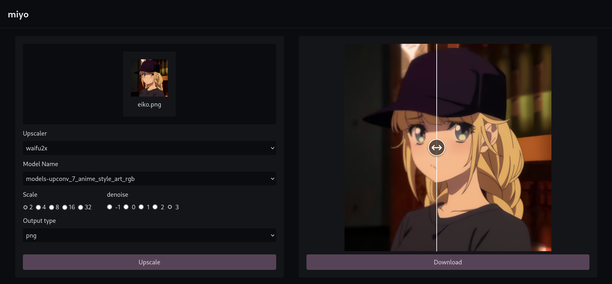

# miyo



A Web UI for [realesrgan-ncnn-vulkan](https://github.com/xinntao/Real-ESRGAN-ncnn-vulkan)
and [waifu2x-ncnn-vulkan](https://github.com/nihui/waifu2x-ncnn-vulkan)

## Deploy

### Systemd Service

This method will build `miyo` from source and deploy it as a systemd service.

#### Requirements:

- go
- bun
- just
- wget
- unzip

```bash
just install
```

### Docker Compose

This is the simplest way to deploy `miyo` using `docker-compose`.
However, NVIDIA GPUs are not supported in this deployment method.

```yaml
version: "3.8"

services:
  miyo:
    container_name: miyo
    image: ghcr.io/veirt/miyo:latest
    build:
      context: .
      args:
        DOCKER_BUILDKIT: 1
    ports:
      - 9452:9452
    devices:
      - /dev/dri:/dev/dri
    restart: unless-stopped
```

## Credits

- [Real-ESRGAN-ncnn-vulkan](https://github.com/xinntao/Real-ESRGAN-ncnn-vulkan) - NCNN implementation of Real-ESRGAN. Real-ESRGAN aims at developing Practical Algorithms for General Image Restoration.
- [waifu2x-ncnn-vulkan](https://github.com/nihui/waifu2x-ncnn-vulkan) - waifu2x converter ncnn version, runs fast on intel / amd / nvidia / apple-silicon GPU with vulkan
